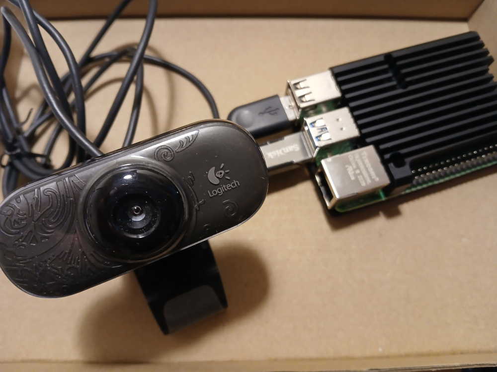

# Raspberry Pi Webcam Security System

A demonstration of how to setup a simple offline Raspberry Pi webcam security system.  The system consists of  a Raspberry Pi 4,  a usb webcam,  and a usb memory drive for storing webcam images and videos. The system is setup to capture and save webcam images every minute, convert images to video and schedule the deletion of images after a period of time.

Images are captured from the webcam using fswebcam and saved to a permanently mounted USB hard drive.  Images are date and time stamped.  A cron job is setup to capture and save webcam images one per minute. A bash script is used to convert captured images to a video (avi) file. A bash is used to clear all dumped images from the USB drive and can be added as a cron job.

 

## Raspberry Pi OS Lite

Use Raspberry Pi Imager to flash Raspberry Pi OS Lite (64-bit) onto a microSD card making sure SSH is enabled. Raspberry Pi Lite has no desktop and so you connect to the Pi via [SSH]([How to use SSH to connect to a remote server in Linux | ssh Command - GeeksforGeeks](https://www.geeksforgeeks.org/ssh-command-in-linux-with-examples/)). As the webcam images are going to be stored on a USB drive mounted as a hard drive you can use a small 32GB microSD card for the OS but make sure it is from reputable brand such as sandisk.

## SSH

Plug in the USB drive that you intent to be used as a hard drive and the Ethernet cable. Boot up the Raspberry Pi and SSH into it from your computer using the terminal command

```
ssh pi@ipaddress
```

Substitute "pi" for your pi username that you created when installing the OS to the microSD card. The ipaddress is the  IP address of your Raspberry Pi. You can discover the IP address of a headless Raspberry Pi using the "arp" command as shown below.

```
arp -a
```

## Required Packages

On the first login perform a complete system update and upgrade as shown below.

```
sudo apt update
sudo apt upgrade
```

Install a terminal text editor. I use the terminal editor [micro](https://micro-editor.github.io/) for creating and editing files but you can use any other terminal editor such as nano, vim etc. You install micro as shown below.

```
sudo apt install micro
```

Install fswebcam using the command below. This application is used to capture webcam images.

```
sudo apt install fswebcam
```

Install v4-utils as shown below. These are a collection of utilities to handle webcam formats and it is used here to find supported webcam resolutions.

```
sudo apt install v4l-utils
```

Install ffmpeg. This is used to create a video from the captured webcam images.

```
sudo apt install ffmpeg
```

You could also use ffmpeg to take images but fswebcam is used in this project.

## Setting Up Hard Drive

The USB stick needs to be setup as a hard drive for storing webcam snapshot images and videos. SD cards can have a high failure rate if regularly writing data to and from them and so a USB drive is a better option for dumping webcam images. This is also the reason why it is not recommended to use the Raspberry Pi OS microSD card for swap space.

The steps below show how I created a permanently mounted USB hard drive for storing webcam image snaphots and videos. There is a video tutorial [here](https://www.youtube.com/watch?v=eQZdPlMH-X8) which broadly outlines the process and will be helpful. 

Use the list block devices (lsblk) command to display information about block devices on a system. 

```
lsblk
```

You should see something like tha below.

```
NAME        MAJ:MIN RM  SIZE RO TYPE MOUNTPOINTS
sda           8:0    1 57.3G  0 disk 
└─sda1        8:1    1 57.3G  0 part 
mmcblk0     179:0    0 29.2G  0 disk 
├─mmcblk0p1 179:1    0  512M  0 part /boot/firmware
└─mmcblk0p2 179:2    0 28.7G  0 part /
```

The mmc device (mmc stands for multimedia card) is the microSD card which stores the Raspberry Pi OS. The /dev/sda1 is the USB stick which we want to use as a hard drive. Here sda stands for storage device a.

To show all devices which have storage on a Raspberry Pi use the command below.

```
sudo fdisk -l
```

Search through the output produced to find the USB drive which will be used as a hard drive. You should find information such as that below.

```
Disk /dev/sda: 57.3 GiB, 61530439680 bytes, 120176640 sectors
Disk model:  SanDisk 3.2Gen1
Units: sectors of 1 * 512 = 512 bytes
Sector size (logical/physical): 512 bytes / 512 bytes
I/O size (minimum/optimal): 512 bytes / 512 bytes
Disklabel type: dos
Disk identifier: 0x00000000

Device     Boot Start       End   Sectors  Size Id Type
/dev/sda1          32 120176639 120176608 57.3G  c W95 FAT32 (LBA)
```

Notice that this drive has a single partition and is formatted with FAT32. To use it as a hard drive we need to delete the partition and re-format the device using the Linux ext4 default file system. We do this using the fdisk command.

```
sudo fdisk /dev/sda
```

When you run fdisk you will get the output similar to that below. In the example above we need to delete the single FAT32 partition using the "d"  delete partition command, then use the p (partition) command to create a new Linux partition with default values and then finally write the changes using the w (write) command. The fdisk output will look similar to that shown below.

```
Welcome to fdisk (util-linux 2.38.1).
Changes will remain in memory only, until you decide to write them.
Be careful before using the write command.

Command (m for help): 

Command (m for help): d
Selected partition 1
Partition 1 has been deleted.

Command (m for help): n
Partition type
   p   primary (0 primary, 0 extended, 4 free)
   e   extended (container for logical partitions)
Select (default p): 

Using default response p.
Partition number (1-4, default 1): 
First sector (2048-120176639, default 2048): 
Last sector, +/-sectors or +/-size{K,M,G,T,P} (2048-120176639, default 120176639): 

Created a new partition 1 of type 'Linux' and of size 57.3 GiB.

Command (m for help): p

Disk /dev/sda: 57.3 GiB, 61530439680 bytes, 120176640 sectors
Disk model:  SanDisk 3.2Gen1
Units: sectors of 1 * 512 = 512 bytes
Sector size (logical/physical): 512 bytes / 512 bytes
I/O size (minimum/optimal): 512 bytes / 512 bytes
Disklabel type: dos
Disk identifier: 0x00000000

Device     Boot Start       End   Sectors  Size Id Type
/dev/sda1        2048 120176639 120174592 57.3G 83 Linux

Command (m for help): w
```

Show all devices again using the fdisk -l command and the /dev/sda1 "Type" should be Linux.

```
sudo fdisk -l
```

The next step is to use mkfs to format the USB device with the ext4 file system. To do this use the command below.

```
sudo mkfs -t ext4 /dev/sda1
```

The USB drive is now formatted  with the Linux ext4 file system but it needs to be mounted so that it is available for use by the operating system. To do this create a mount point in the system mnt (mount) directory called hd1 (hard drive 1) as shown below.

```
sudo mkdir /mnt/hd1
```

This creates a mount point currently owned by the root user.  Now change the ownership of this mount point to the pi user as shown below.

```
sudo chown pi:pi /mnt/hd1
```

Again substitute pi with you pi username.

The next step is to find the Universally Unique Identifier (UUID) for the USB drive.  In Linux, UUIDs are used to identify media storage devices, such as block devices and partitions.

```
sudo blkid
```

The output should look like that shown below.

```
/dev/mmcblk0p1: LABEL_FATBOOT="bootfs" LABEL="bootfs" UUID="4EF5-6F55" BLOCK_SIZE="512" TYPE="vfat" PARTUUID="15d57b8f-01"
/dev/mmcblk0p2: LABEL="rootfs" UUID="ce208fd3-38a8-424a-87a2-cd44114eb820" BLOCK_SIZE="4096" TYPE="ext4" PARTUUID="15d57b8f-02"
/dev/sda1: UUID="9522b771-c365-4c93-b2c2-47e4529717b4" BLOCK_SIZE="4096" TYPE="ext4"
```

Now edit the ftab configuration file to add an entry for the USB drive. In Linux, fstab  (short for file system table) controls how the file system and devices are mounted when the system boots. Copy the UUID number and open fstab as shown below.

```
sudo micro /etc/fstab
```

Using the copied UUID add the following line to the bottom of the file not changing anything else. Each element on the line is separated with a tab.

```
UUID =9522b771-c365-4c93-b2c2-47e4529717b4 /mnt/hd1 ext4    defaults    0   1
```

Save and exit. Use the mount command as shown below to mount the hd1 list the block devices again.

```
sudo mount -a
lsblk
```

NAME        MAJ:MIN RM  SIZE RO TYPE MOUNTPOINTS
sda           8:0    1 57.3G  0 disk 
└─sda1        8:1    1 57.3G  0 part /mnt/hd1
mmcblk0     179:0    0 29.2G  0 disk 
├─mmcblk0p1 179:1    0  512M  0 part /boot/firmware
└─mmcblk0p2 179:2    0 28.7G  0 part /

This time the lsblk command should show that sda1 is mounted at /mnt/hd1. Now check that you can create a file on the USB hard drive (hd1) using the touch command. The touch command is used to create a new empty file. 

```
cd /mnt/hd1
touch test.txt
```

When you do this you will most likley get the following error "touch: cannot touch 'text.txt': Permission denied". To solve this we need to change access permissions.

Use the cd command to move up to the mnt directory (see  example below) and then use chmod  to change the access permissions. In Linux, the command chmod 777 gives all users full permissions to a file or directory, including read, write, and execute. This can be done recursively using the -R option.

```
cd ..
sudo chmod -R 777 hd1
ls -lha
cd hd1
touch test.txt
```

Now when you do "touch text.txt" a new file is created and stored on hd1.

Next perform a reboot.

```
sudo reboot
```

Check that /mnt/hd1 is mounted correctly and the Pi user can write and save files to the USB hard drive. 

Now make two directories on the hard drive (hd1) called webcam and videos

```
mkdir /mnt/hd1/webcam
mkdir /mnt/hd1/videos
```

The webcam folder will be used to store webcam image snaphots while the videos folder will be used to store movies created from the webcam snapshot images.

## Temporarily Connecting Another USB

To plug-in and temporarily connect another USB device to transfer files externally you can create a mount point in the media directory and mount the USB to this as shown in the example below.

```
sudo mkdir /media/usb
lsblk
sudo mount /dev/sdb1 /media/usb
cd /media/usb
ls
```

To un-mount the USB drive you use the umount command as shown below.

```
sudo umount /media/usb
```

Note that the mount command defaults to the root user.

## Webcam

The next step is to capture an image from a webcam and save it onto the USB disk drive.

To find the supported webcam resolutions use the command below.

```
v4l2-ctl --list-formats-ext | more
```

This will list the YUYV and MPEG formats which are supported by the webcam. Assuming that 640x480 resolution is supported (most webcam support this resolution) you can capture a test image using the command below.

```
fswebcam -r 640x480 test.jpg
```

This will dump a captured image in the current folder.

The bash script below called "capture_usb.sh" shows how to capture an image from a webcam and save it to the webcam directory on USB hard drive (hd1). 

```
#!/bin/bash

DATE=$(date +"%Y-%m-%d-%H-%M")

fswebcam -r 640x480 -S 10 -F 16 /mnt/hd1/webcam/$DATE.jpg
```

The DATE variable is used to time stamp each captured image so that images can be sorted and converted into a movie file. Some options have been used with fswebcam. The "-S 10" option skips the first 10 frames to let the webcam settle before capturing an image. The "-F 16" option captures 16 images in sequence and averages them into one. I found this produces a clearer image with an old webcam that I am using.

The script must have executable permission to run. Use "chmod" to make the script executable. 

```
chmod +x capture_usb.sh
```

## Crontab

Crontab is a file in Linux that contains the schedules for tasks to be executed at specific times and dates which are known as cron jobs. With Linux there is a cron daemon which is an unattended program that runs in the background and executes tasks when needed. The crontab file contains instructions for the cron daemon, such as which command to run, when, and on what date.

To create a cron job, you edit the crontab file and add a new entry. The crontab time and date entry has five fields: minutes, hours, day of the month, month, and day of the week. Basically a cron job entry has the format below.

```
 +---------------- minute (0 - 59)
 |  +------------- hour (0 - 23)
 |  |  +---------- day of month (1 - 31)
 |  |  |  +------- month (1 - 12)
 |  |  |  |  +---- day of week (0 - 6) (Sunday=0 or 7)
 |  |  |  |  |
 *  *  *  *  *  path/to/script.sh
```

Open the crontab file using the command below.

```
crontab -e
```

Add the following line to the end of the crontab file which schedules capturing webcam images every minute. 

```
* * * * * /home/pi/capture_usb.sh > /dev/null 2>&1
```

Here "2>&1" redirects standard error to standard output and redirection is to the Linux null device (/dev/null).

If you wanted to capture images every two minutes you would use the line below.

```
*/2 * * * * /home/pi/capture_usb.sh > /dev/null 2>&1
```

See the references below for more information about cron jobs.

## Converting Webcam Images to Video

Before deleting all webcam images captured over a period of time these can be converted into a video. The script below shows how to do this.

```
#!/bin/bash

DATE=$(date +"%Y-%m-%d-%H-%M")

cd /mnt/hd1/webcam

cat $(ls | sort -V) | ffmpeg -framerate 10 -i - -vcodec libx264 -pix_fmt yuv420p -r 20 $DATE.avi

date
echo  video created from webcam images
echo moving video to videos directory

mv $DATE.avi /mnt/hd1/videos
```

This script is called makeavi_usb.sh and again must be executable. The scrip can be added as a cron job as shown below

```
30 16 * * * /home/pi/makeavi_usb.sh > /dev/null 2>&1
```

This creates the security webcam video at 4.30pm in the afternoon.

## Deleting Webcam Images

Capturing webcam security images every minute leads to a lot of images being stored on the USB hard drive. If capturing 60 images per hour (one per minute) then in 24 hour 1440 images would be capture. A mechanism is needed to delete these images on a regular basis. 

The script below shows how to delete the captured images stored in the webcam directory on the USB drive.

```
#!/bin/bash

echo removing webcam images
date

rm -rf /mnt/hd1/webcam/*
```

This script is called clean_usb.sh. Again this can be added as a cron job as shown below.

```
35 16 * * * /home/pi/clean_usb.sh > /dev/null 2>&1
```

This deletes the security webcam images at 4.35pm in the afternoon (after the video has been created).

## Putting It All Together

You should have three scripts in your Raspberry Pi home directory called

```
capture_usb.sh
makeavi_usb.sh
clean_usb.sh
```

An example of how the crontab file should be modified is shown below.

```
* * * * * /home/pi/capture_usb.sh > /dev/null 2>&1
30 16 * * * /home/pi/makeavi_usb.sh > /dev/null 2>&1
35 16 * * * /home/pi/clean_usb.sh > /dev/null 2>&1
```

This sets up the webcam security system to capture images every minute, make a video file at 4.30pm and then delete the webcam snapshot images at 4.35pm. 

## Tranfering Files

The scp command can be used to copy files between a two computers e.g. a local computer and the  Raspberry Pi. You need to ensure that the ssh server on the local computer is listening on port 22 to use the scp command. This usually involves editing the ssh daemon (sshd) configuration file and removing the comment from the "#port 22" and then restarting the ssh daemon. 

```
sudo micro /etc/ssh/sshd_config
systemctl restart sshd
systemctl status sshd
```

If this does not work check that the listening socket is set to port 22

```
sudo systemctl edit sshd.socket
```

An example of how a file can be transferred is shown below.

```
cd /mnt/hd1/videos
scp 2025-01-07-13-26.avi username@192.168.0.34:/home/username/Videos
```

## Shutdown

To shutdown the Raspberry Pi webcam security system use

```
sudo shutdown -h now
```

## Summary

Once the webcam security system has been setup it can be left pretty much unattended just logging into the system to delete or transfer security videos.

There are other software applications such as [motion](https://motion-project.github.io/) which can be used to start capturing images when motion is detected but these are accessed through a web interface. The approach outlined here is a local webcam security system.

## References

[Raspberry Pi Foundation](https://www.raspberrypi.org/)

[Connect a HardDrive USB Stick on a RaspberryPi From Terminal](https://www.youtube.com/watch?v=eQZdPlMH-X8)

[Understanding Crontab in Linux with 20 Useful Examples for Scheduling Tasks](https://tecadmin.net/crontab-in-linux-with-20-examples-of-cron-schedule/)
